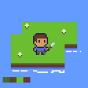

# Projeto de Sobrevivência em Ilha - Godot 4

## Visão Geral

Um jogo 2D top-down de sobrevivência onde você está preso em uma ilha com recursos finitos. Sua missão é gerenciar recursos, enfrentar criaturas e construir uma jangada para escapar.

## Mecânicas Principais

- **Sobrevivência**: Gerencie fome, sede, saúde e cansaço
- **Coleta de Recursos**: Madeira, pedra, fibras e alimentos (todos finitos)
- **Crafting**: Crie ferramentas, armas, abrigo e a jangada final
- **Combate**: Enfrente criaturas que protegem recursos valiosos
- **Exploração**: Descubra diferentes áreas da ilha com recursos variados

## Progressão

1. **Fase Inicial**: Coletar recursos básicos e ferramentas simples
2. **Fase Intermediária**: Explorar a ilha e gerenciar necessidades
3. **Fase Final**: Encontrar recursos raros e construir a jangada de escape

## Controles

- **Movimento**: WASD/Setas
- **Interagir**: E
- **Atacar**: Clique esquerdo
- **Inventário**: I
- **Crafting**: C

## Requisitos Técnicos

- Motor: Godot 4.2+
- Estilo: Pixel art 16x16 ou 32x32
- Gênero: Sobrevivência, aventura, estratégia

## Objetivo Final

Coletar todos os recursos necessários para construir uma jangada e escapar da ilha antes que os recursos se esgotem completamente.

**Status do projeto**: Em desenvolvimento inicial

---
